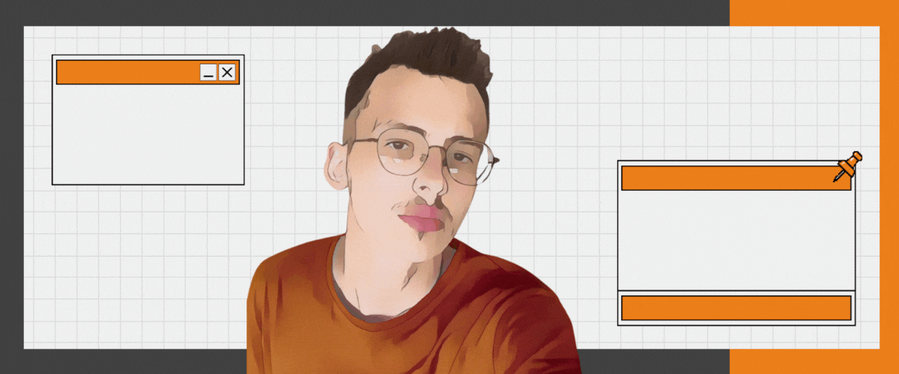

<h2 align="center" style="color:#FF8C00;text-shadow: 3px 4px 4px rgba(255, 140, 0, 0.7);">Merhaba, ben Mustafa Arda! 👋</h2>

<div align="center">
  
</div>

<p align="center">
    <a href="https://github.com/dusova" target="_blank"></a>
    <a href="https://www.instagram.com/mdusova/" target="_blank"></a>
    <a href="https://linkedin.com/in/mdusova/" target="_blank"></a>
    <a href="https://open.spotify.com/user/31e4wu2ua42rf5qvqaukgjwgz7tu" target="_blank"></a>
    <a href="https://github.com/dusova/" target="_blank"></a>
</p>

<div align="center">
  
</div>

## 🧠 Hakkımda | About Me


Dijital dünyanın dinamik yapısına olan ilgim beni web geliştirme, sosyal medya yönetimi ve SEO optimizasyonu alanlarında sürekli kendimi geliştirmeye yönlendirdi. Web teknolojileri alanında edindiğim bilgi ve deneyim ile kullanıcı dostu, işlevsel ve görsel açıdan etkileyici web siteleri tasarlıyorum.

Aynı zamanda, markaların dijital dünyada daha görünür olmaları için sosyal medya stratejileri oluşturuyor ve Google SEO & Adwords ile online varlıklarını güçlendirmelerine yardımcı oluyorum. Sürekli öğrenmeye ve yeni teknolojileri keşfetmeye olan tutkum, Flutter ve Python gibi alanlarda kendimi geliştirmeme olanak sağlıyor.

My passion for the digital world's dynamic nature has led me to continuously improve myself in web development, social media management, and SEO optimization. With my knowledge and experience in web technologies, I design user-friendly, functional, and visually impressive websites.

I also create social media strategies to help brands become more visible in the digital world and strengthen their online presence through Google SEO & Adwords. My passion for continuous learning and exploring new technologies allows me to develop my skills in areas such as Flutter and Python.

<div align="center">
  
</div>

## 💻 Web Geliştirme | Web Development

```javascript
const skills = {
  frontEnd: ["HTML", "CSS", "JavaScript"],
  backEnd: ["PHP", "C#"],
  database: ["MySQL"],
  learning: ["Flutter", "Python"],
  focus: "Creating responsive and user-friendly web experiences"
};
```

<div align="center">
  <p>
    
    
    
    
    
    
    
    
  </p>
</div>

<div align="center">
  
</div>

## 📱 Dijital Pazarlama | Digital Marketing

<table width="100%">
  <tr>
    <td valign="top" width="50%">
      <h3 align="center" style="color:#FF8C00">Sosyal Medya Yönetimi | Social Media Management</h3>
      <div align="center" style="display:flex; justify-content:space-between; flex-wrap:wrap; gap:5px; margin:0 10px;">
        
        
        
      </div>
      <div align="center" style="margin-top:10px; display:flex; flex-direction:column;">
        <span>🎯 İçerik oluşturma | Content creation</span>
        <span>🎯 Topluluk yönetimi | Community management</span>
        <span>🎯 Kampanya planlaması | Campaign planning</span>
        <span>🎯 Analitik inceleme | Analytics review</span>
      </div>
    </td>
    <td valign="top" width="50%">
      <h3 align="center" style="color:#FF8C00">SEO & Google Ads</h3>
      <div align="center" style="display:flex; justify-content:space-between; flex-wrap:wrap; gap:5px; margin:0 10px;">
        
        
        
      </div>
      <div align="center" style="margin-top:10px; display:flex; flex-direction:column;">
        <span>🎯 Anahtar kelime analizi | Keyword analysis</span>
        <span>🎯 SEO optimizasyonu | SEO optimization</span>
        <span>🎯 PPC kampanyaları | PPC campaigns</span>
        <span>🎯 Performans takibi | Performance tracking</span>
      </div>
    </td>
  </tr>
</table>

<div align="center">
  
</div>

## 🛒 E-Ticaret | E-Commerce

> **Deneyim | Experience:** E-ticaret platformlarının kurulumu ve yönetimi, dijital pazarlama stratejilerinin geliştirilmesi

> **Araçlar | Tools:** 
> <p align="center">
>   
>   
>   
>   
> </p>

> **Uzmanlık | Expertise:** Ürün listeleme, SEO optimizasyonu, sosyal medya entegrasyonu, kampanya planlama ve analizi

<div align="center">
  
</div>

## 🎵 Spotify'da Son Dinlediğim Müzikler | My Recently Played Music

> Kendi Spotify API projem | My own Spotify API project

[](https://spotify.mdusova.com/api?user=31e4wu2ua42rf5qvqaukgjwgz7tu)

<div align="center">
  
</div>

## 📈 GitHub İstatistiklerim | My GitHub Stats

<p align="center">
  
  
</p>

<div align="center">
  
</div>

## 🎯 İlgi Alanlarım | My Interests

<div align="center">
  
</div>

<div align="center">
  
</div>

<h3 align="center" style="color:#FF8C00">✨ Benimle İletişime Geçin | Connect With Me ✨</h3>

<p align="center">
  <a href="mailto:contact@mdusova.com">
    
  </a>
  <a href="https://mdusova.com">
    
  </a>
</p>
