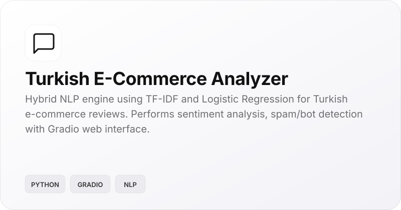
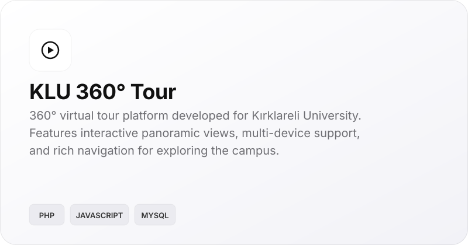
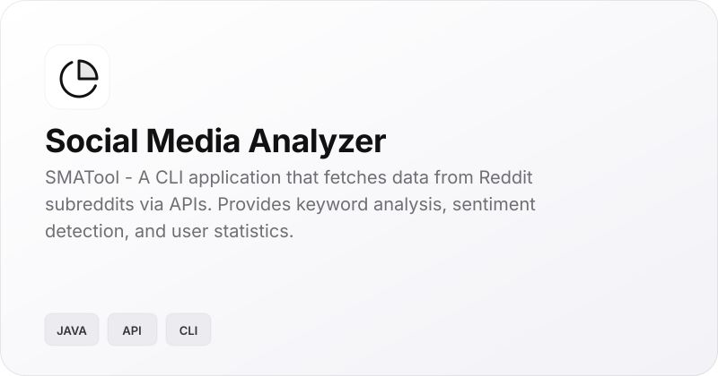

  <a href="https://github.com/dusova">
    <picture>
      <source media="(prefers-color-scheme: dark)" srcset="./assets/hero-dark.svg">
      <source media="(prefers-color-scheme: light)" srcset="./assets/hero-light.svg">
      
    </picture>
  </a>

 

  

    <b>Mustafa Arda Düşova</b> — I design and build digital products. 
    I blend aesthetics with engineering to ship scalable, user-centered, and secure experiences.
  

  <a href="https://codewithmad.com"><b>Portfolio</b></a>
  &nbsp;·&nbsp;
  <a href="https://linkedin.com/in/mdusova/"><b>LinkedIn</b></a>
  &nbsp;·&nbsp;
  <a href="mailto:arda@codewithmad.com"><b>Email</b></a>
  &nbsp;·&nbsp;
  <a href="https://github.com/dusova?tab=repositories"><b>Repositories</b></a>

 

  <picture>
    <source media="(prefers-color-scheme: dark)"
      srcset="https://github-readme-stats.vercel.app/api?username=dusova&show_icons=true&theme=transparent&hide_border=true&title_color=E6E6E6&text_color=BDBDBD&icon_color=E6E6E6&count_private=true" />
    
  </picture>

  <picture>
    <source media="(prefers-color-scheme: dark)"
      srcset="https://github-readme-stats.vercel.app/api/top-langs/?username=dusova&layout=compact&theme=transparent&hide_border=true&title_color=E6E6E6&text_color=BDBDBD" />
    
  </picture>

 

  <picture>
    <source media="(prefers-color-scheme: dark)"
      srcset="https://streak-stats.demolab.com?user=dusova&theme=transparent&hide_border=true&ring=E6E6E6&fire=E6E6E6&currStreakLabel=E6E6E6&sideLabels=BDBDBD&dates=8A8A8A&currStreakNum=E6E6E6&sideNums=E6E6E6" />
    
  </picture>

  

  <picture>
    <source media="(prefers-color-scheme: dark)" srcset="./assets/section-now-dark.svg">
    <source media="(prefers-color-scheme: light)" srcset="./assets/section-now-light.svg">
    
  </picture>

    

  <code>Focus:</code> <b>AI-Augmented Web Architectures</b> 
  <code>R&amp;D:</code> <b>Applied Cryptography &amp; Data Security</b> 
  <code>Practice:</code> <b>Data-driven analysis tools &amp; productization</b>

 

  
    Minimal design, clean code, measurable performance, and security by default. 
    In short: <b>beautiful systems that hold up under pressure</b>.
  

  

  <picture>
    <source media="(prefers-color-scheme: dark)" srcset="./assets/section-stack-dark.svg">
    <source media="(prefers-color-scheme: light)" srcset="./assets/section-stack-light.svg">
    
  </picture>

 

  
  
  
  
    

  
  
  
    

  
  
  
    

  
  

  

  <picture>
    <source media="(prefers-color-scheme: dark)" srcset="./assets/section-projects-dark.svg">
    <source media="(prefers-color-scheme: light)" srcset="./assets/section-projects-light.svg">
    
  </picture>

 

<!-- Project cards (your custom SVG cards) -->

  <a href="https://github.com/dusova/Turkish-ECommerce-Sentiment-Spam-Analyzer" title="Turkish E-Commerce Analyzer">
    <picture>
      <source media="(prefers-color-scheme: dark)" srcset="./assets/project-ecommerce-analyzer-dark.svg">
      <source media="(prefers-color-scheme: light)" srcset="./assets/project-ecommerce-analyzer-light.svg">
      
    </picture>
  </a>
  &nbsp;&nbsp;
  <a href="https://github.com/dusova/klu360" title="KLU 360 Virtual Tour">
    <picture>
      <source media="(prefers-color-scheme: dark)" srcset="./assets/project-klu360-dark.svg">
      <source media="(prefers-color-scheme: light)" srcset="./assets/project-klu360-light.svg">
      
    </picture>
  </a>

  
    <b>Turkish E-Commerce Analyzer</b> — Hybrid NLP engine for sentiment & insight extraction 
    <b>KLU 360 Virtual Tour</b> — Interactive panoramic campus experience
  

 

  <a href="https://github.com/dusova/wallst-consulting-website" title="Wall Street Consulting LLC.">
    <picture>
      <source media="(prefers-color-scheme: dark)" srcset="./assets/project-wallstreet-dark.svg">
      <source media="(prefers-color-scheme: light)" srcset="./assets/project-wallstreet-light.svg">
      
    </picture>
  </a>
&nbsp;&nbsp;
  <a href="https://github.com/dusova/social-media-analyzer-tool" title="Social Media Analyzer Tool">
    <picture>
      <source media="(prefers-color-scheme: dark)" srcset="./assets/project-social-analyzer-dark.svg">
      <source media="(prefers-color-scheme: light)" srcset="./assets/project-social-analyzer-light.svg">
      
    </picture>
  </a>

  
    <b>Wall St Consulting</b> — Web platform + CRM + ops dashboard 
    <b>Social Media Analyzer</b> — API-based data fetching & analysis CLI
  

  

  
<b>How I build (readable, but deep)</b>

   
  <ul>
    <li><b>Product thinking:</b> not just “it works” — measurable impact + strong UX.</li>
    <li><b>Architecture:</b> modularity, testability, and observability (logs/metrics).</li>
    <li><b>Security:</b> correct crypto, correct storage, correct access control.</li>
    <li><b>Performance:</b> cut waste, optimize critical paths, ship faster.</li>
  </ul>

 

  <picture>
    <source media="(prefers-color-scheme: dark)"
      srcset="https://github-readme-activity-graph.vercel.app/graph?username=dusova&bg_color=00000000&color=BDBDBD&line=E6E6E6&point=E6E6E6&area=true&hide_border=true"/>
    
  </picture>

  

  <picture>
    <source media="(prefers-color-scheme: dark)" srcset="./assets/section-contact-dark.svg">
    <source media="(prefers-color-scheme: light)" srcset="./assets/section-contact-light.svg">
    
  </picture>

    

  &nbsp;
  &nbsp;
  

    

  
    For collaborations: send a short brief (goal + constraints + timeline) — I’ll reply with a clean technical plan.
  

  

  

 

  © Mustafa Arda Düşova — Built with taste, shipped with discipline.

